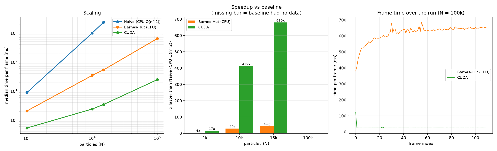

# IPhysicsEngine
IPhysicsEngine is a 3D rigid-body physics engine library written in c++. This engine was based upon the engine found in "Game physics engine development" by Ian Millington.

## Features
It Features:
- 3D rigid-body physics
- Collision detection and response *(in progress)*

## How to compile and run
### Requirements
The follow are required for the library and the apps to run:
- CMAKE
- Raylib
IF YOU HAVE A CUDA CAPABLE DEVICE
- CUDA Toolkit

### Compiling
When compiling its recommended to make a new build folder and preform the cmake build there.
Before building its recommended to change the *Enable CUDA gravity backends* option in the CMakeLists.txt
line to OFF or ON depending upon if your computer has a CUDA capable device or not.

## Apps
The apps folder contains apps that showcase the features of the physics engine.
The apps provided so far are:
- IGravity
- IPlanetSimulator

## IGravity
### General
IGravity is a 2D particle gravity simulator that simulates tens of thousands of particles at any given moment.
This Program showcases 3 main algorithms: the naive O(n^2), the Barnes-hut algorithm and one utilising CUDA to massively optimise the simulation using parallel computing.
You can add as many particles as you want up to a limit of 100k particles.

### Benchmark
To test the performance of these algorithms, I compared the median time per frame for a given amount of particles. The results showcase that consistently, the CUDA algorithm had the lowest median frame times allowing for the most overall smoothest experience. Results are shown below:

## IPlanetSimulator
### General
IPlanetSimulator is a 3D particle gravity simulator that simulates planet orbits.
You can add as many planets as you want and change their parameters.
